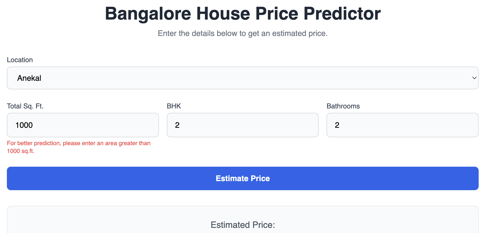
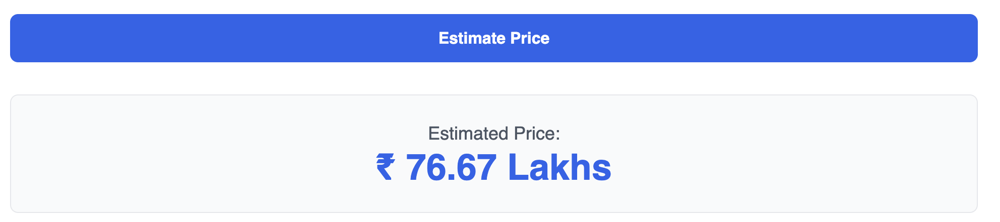

# Bangalore House Price Prediction - Project ka Flow

Yeh project teen hisson mein bata hua hai:

1. **Data ki Safai (Data Cleaning)**: Sabse pehle, humein jo raw data (Bengaluru_House_Data.csv) mila hai, woh kaafi messy hai. Usmein faltu columns, missing values, aur ajeeb formats hain. Hum Python ki Pandas library ka istemal karke is data ko saaf-suthra aur machine learning model ke liye taiyar karenge.

2. **Formula se Model Banana (Model Simulation)**: Machine learning koi jaadu nahi hai, yeh data se seekha hua ek formula hi hota hai. Is part mein, hum ek simple function banayenge jo ek pehle se tay kiye gaye formula (Base Price + BHK * Price per BHK) ka istemal karke ghar ki keemat predict karega. Isse humein model ki basic working samajh aayegi.

3. **Poori Web App Banana (Complete ML Web App)**: Yeh final part hai. Ismein hum saaf kiye gaye data par ek asli Machine Learning model (Linear Regression) train karenge. Phir, hum ek web page (HTML, CSS, JavaScript) banayenge jahan user ghar ki details (jaise location, size, bathroom) daal kar real-time mein uski anumanit keemat (estimated price) jaan payega.

---

## Part 1: Data ki Safai (Clean the Bangalore House Price Dataset)

### Problem Statement (Hinglish Mein)
Humein ek raw dataset Bengaluru_House_Data.csv diya gaya hai. Isse pehle ki hum is par model banayein, humein isko saaf karna hoga. Ismein area_type, society jaise zaroori na hone wale columns hain, kuch jagah data missing hai (NaN), aur size aur total_sqft jaise columns ka format theek nahi hai. Hamara kaam Pandas ka use karke is data ko saaf karna aur ek nayi CSV file cleaned_bengaluru_house_data.csv mein save karna hai.

### Code ka Flow / Checkpoints
- **Data Load Karna**: CSV file ko Pandas DataFrame mein load karenge.  
- **Faltu Columns Hatana**: area_type, society, balcony, availability columns ko drop karenge.  
- **Missing Values Hatana**: Jin rows mein koi bhi value missing (NaN) hai, unhe poori tarah se hata denge.  
- **'size' Column Saaf Karna**: Is column se sirf number (jaise '2 BHK' se 2) nikaal kar ek naya 'bhk' column banayenge.  
- **'total_sqft' Column Saaf Karna**: Is column mein jo range (jaise '1133 - 1384') hai, uska average nikaal kar use ek single number mein badlenge.  
- **Bachi hui Missing Values Hatana**: total_sqft ko saaf karne ke baad agar koi nayi missing value aati hai, use bhi hata denge.  
- **Saaf Data Save Karna**: Final DataFrame ko cleaned_bengaluru_house_data.csv naam ki file mein bina index ke save karenge.  

---

## Part 2: Formula se Model Banana (Simulating a Model with a Formula)

### Problem Statement (Hinglish Mein)
Ek machine learning model data se seekhe gaye formula ki tarah hota hai. Is part mein, humein ek simple model banana hai. Humein har location ke liye base_price aur har extra kamre (BHK) ke liye price_per_bhk diya gaya hai. Humein ek Python function calculate_price banana hai jo in values ka use karke ghar ki anumanit keemat (estimated price) bataye. Formula hai:  

**Keemat = Base Price + (BHK * Price per BHK)**  

---

## Part 3: Poori Web App Banana (Build the Complete House Price Prediction Web App)

### Problem Statement (Hinglish Mein)
Ab project ke aakhri hisse mein, hum sab kuch jodenge. Hum cleaned_bengaluru_house_data.csv data ka istemal karke ek asli machine learning model (Linear Regression) train karenge. Phir, hum ek interactive web page banayenge jahan user location, square feet, BHK, aur bathroom jaise inputs dekar ghar ki keemat ka anuman laga sakega.

### Code ka Flow / Checkpoints

#### Model Training (model.py ka logic):
- Saaf kiya hua data load karenge.  
- location jaise text data ko model ke liye taiyar karenge (One-Hot Encoding).  
- Data ko features (X) aur target (y) mein alag karenge.  
- Linear Regression model ko train karenge.  

#### Web App (main.py ka logic):
- Ek sundar sa HTML form banayenge.  
- CSS (Tailwind) se use style karenge.  
- JavaScript likhenge jo user ke input ko lega.  
- JavaScript mein hi trained model ke logic (coefficients) ka istemal karke price calculate karega aur user ko screen par dikhayega.  

### Python Code: Model Training (To get coefficients for JS)
Yeh script humein woh "magic numbers" (coefficients) degi jinka istemal hum apni web app mein karenge.  

---

# Final Project Report

## Project ka Sankshep (Project Summary)
Is project mein humne Bangalore ke gharon ki keemat predict karne ke liye ek end-to-end web application banayi. Humne teen mukhya charano mein kaam kiya:

1. **Data Cleaning**: Raw aur messy data ko saaf karke model training ke liye taiyar kiya.  
2. **Model Simulation**: Ek simple formula-based function banakar machine learning model ke piche ka basic logic samjha.  
3. **Complete Web App**: Saaf data par ek Linear Regression model train kiya aur ek interactive web page banaya jahan user live predictions prapt kar sakta hai.  

---

## Mukhya Avlokan (Key Observations)
- **Data Cleaning Zaroori Hai**: Raw data mein inconsistent formats (total_sqft mein range), non-numeric data (size), aur missing values the. Inke bina model train karna asambhav tha. Data cleaning is pipeline ka sabse zaroori aur samay lene wala hissa tha.  
- **Location ka Mahatva**: Ghar ki keemat par location ka sabse zyada prabhav padta hai. Isliye, humne One-Hot Encoding ka istemal karke 'location' column ko model ke liye taiyar kiya, jisse model har location ke price par asar ko alag se samajh saka.  
- **Feature ka Rishta**: total_sqft, bhk, aur bath jaise features ka price ke saath seedha rishta hai. Model ne in features ke liye positive aur negative weights (coefficients) seekhe, jo batate hain ki woh price ko kitna badhate ya ghatate hain.  

---

## Nishkarsh aur Agle Kadam (Conclusion and Next Steps)

### Nishkarsh (Conclusion):
Hum safaltapoorvak ek poora machine learning project banane mein kaamyaab rahe, data cleaning se lekar ek functional web app tak. Yeh project dikhata hai ki kaise Python, Pandas, Scikit-learn, aur basic web technologies (HTML/JS) ka istemal karke powerful data-driven applications banayi ja sakti hain. Humara Linear Regression model ek accha baseline pradan karta hai jo real-world estimations ke liye istemal kiya ja sakta hai.

### Agle Kadam (Future Scope):
- **Behtar Models ka Upyog**: Hum Linear Regression ke alawa Random Forest ya Gradient Boosting jaise zyada advanced models try kar sakte hain, jo shayad aur behtar accuracy de sakein.  
- **Backend Framework**: Abhi humne model ka logic JavaScript mein daala hai. Ek behtar approach Python backend framework jaise Flask ya Django ka use karna hai, jahan hum trained model file (.pkl ya .joblib) ko load karke real-time predictions de sakte hain.  
- **Deployment**: Is poori web application ko cloud platforms jaise Heroku, AWS, ya Google Cloud par deploy kiya ja sakta hai taaki koi bhi ise internet par use kar sake.  
- **Aur Features Shamil Karna**: Model ko aur behtar banane ke liye hum 'age of property', 'proximity to metro station', 'floor number' jaise naye features shamil kar sakte hain.  
----

## Tech Stack and Libraries Used

### Language:
- Python

### Libraries:
- **Pandas** (Data Manipulation)
- **Scikit-learn** (Model Training)

### Frontend:
- **HTML**
- **Tailwind CSS**
- **JavaScript**

### Notebook:
- **Jupyter Notebook**

## Project Structure

To keep the project organized, the following file structure has been used:

```txt

Bangalore\_House\_Price\_Prediction/
│
├── data/
│   ├── Bengaluru\_House\_Data.csv           (Raw Data)
│   └── cleaned\_bengaluru\_house\_data.csv  (Cleaned Data)
│
├── scripts/
│   ├── data\_cleaning.py                  (Data Cleaning Script)
│   └── model\_training.py                 (Model Training Script)
│
├── notebooks/
│   └── main.ipynb                        (Model Training and Analysis Notebook)
│
├── webapp/
│   └── index.html                        (Web App for Prediction)
│
└── requirements.txt                      (Required Python Libraries)

```

## How to Run the Project (Step-by-Step)

Follow these steps to run the project on your local machine:

### Step 1: Project Setup

1. **Clone the repository** (if available on GitHub) or download the project folder.
   
2. Open the terminal and navigate to the root directory of the project:

   ```bash
   cd Bangalore_House_Price_Prediction
   ```

3. **Install the required libraries**:

   ```bash
   pip install -r requirements.txt
   ```

### Step 2: Clean the Data

1. First, clean the raw data by running the data cleaning script:

   ```bash
   python scripts/data_cleaning.py
   ```

2. This script will generate a new file, `cleaned_bengaluru_house_data.csv`, inside the `data/` folder.

### Step 3: Train the Machine Learning Model

1. Now, train the model on the cleaned data by running the model training script:

   ```bash
   python scripts/model_training.py
   ```

2. The script will print the **Intercept** and **Coefficients** of all the features in the terminal. Copy these values for the next step.

### Step 4: Update the Web App

1. Open the `webapp/index.html` file in a text editor.

2. Inside the `<script>` section, you will find a JavaScript object named `modelParams`.

3. Paste the **Intercept** and **Coefficients** values you copied from Step 3 into the `modelParams` object.

### Step 5: Run the Web App

1. Double-click on the `webapp/index.html` file to open it in your web browser.

2. Now, you can enter the details of a house to get the predicted price!

## Screenshots

### Main Web Application Page

This is the main interface of the web app where users can enter house details.



### Price Prediction Result

After entering the details, the model will display the estimated price for the house.



